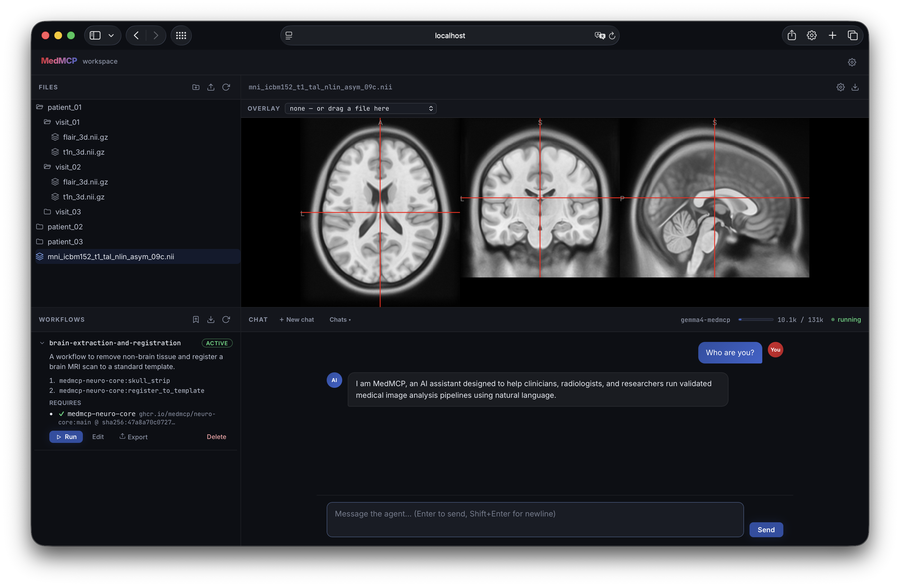

# MedMCP: An Open Agentic Ecosystem for Medical Imaging Workflows
<p align="center">
  
</p>

<p align="center">
  <a href="https://medmcp.ai"><b>medmcp.ai</b></a> ·
  <a href="#quick-start">Quick start</a> ·
  <a href="#security">Security</a> ·
  <a href="CONTRIBUTING.md">Contributing</a>
</p>

MedMCP is an open, community-driven agentic framework that exposes validated medical imaging tools through a natural-language interface.
It is designed to enable clinicians, radiologists, and domain researchers to apply state-of-the-art image analysis methods without requiring expertise in command-line interfaces, Python environment management, or library-specific APIs.

Everything runs **on-premise**: a locally served model plans and sequences the work, all computation is delegated to tested implementations, and no imaging data, patient metadata, or results leave your infrastructure. You work through a single workspace that contains a *file explorer, image viewer, replay engine for personal workflows, and the chat interface*.

> [!WARNING]
> MedMCP is under active development and **not licensed for clinical use**.

---

## Quick start

The easiest way to run MedMCP is with the prebuilt Docker images.

**Start with a single command:** Set `MEDMCP_WORKSPACE` to the folder where your imaging data lives and results should be saved (any absolute path):

```bash
MEDMCP_WORKSPACE="$HOME/medmcp-data" \
  docker compose -f oci://ghcr.io/medmcp/compose:main up -d
```
Then open **http://localhost:8100**.

**Requirements:** Linux OS with an NVIDIA GPU (≥ 24 GB VRAM recommended for the local Muse Glimmer 30B model), a recent driver (≥ R570 / CUDA 12.8), and Docker with GPU access via the [NVIDIA Container Toolkit](https://docs.nvidia.com/datacenter/cloud-native/) (CDI; rootless Docker works).

**Stop** with `docker compose -f oci://ghcr.io/medmcp/compose:main down`.

**Update** by re-running the start command with `--pull always`.

> Want to build from source or run host-native? See **[CONTRIBUTING.md](CONTRIBUTING.md)**.

---

## Features

- **Chat & Agent**: a familiar interface to interact with your local models, tools, and skills.
- **File explorer**: a builtin file explorer to organize your data.
- **Image viewer**: a builtin image viewer for medical images (`.nii.gz`, `.nrrd`, `.dcm`, ...) and other file formats (`.pdf`, `.csv`, ...).
- **Replay engine**: a replay engine for distilling and replaying processing pipelines into shareable workflows.
- **Easy to extend**: easily install new imaging capabilities through the UI.

---

## Security

MedMCP assumes the local model can be steered by prompt injection (e.g. text pasted from untrusted documents), so its safety model is built around explicit user control:

- **No auto-approval**: every tool call (bash, file writes, web fetches) requires an explicit click.
- **Localhost only**: the server binds to localhost. Do not expose port 8100 over a network without adding real authentication.
- **No data egress**: `web_search` is disabled and `web_fetch` requires approval.
- **Isolated tool stacks**: stack containers run with `--network none`, all capabilities dropped, and no privilege escalation. They bake their models at build time, so a tool call cannot reach the network even if the agent is steered into making one. A stack that genuinely needs egress must declare it in its image label.

To report a vulnerability, see **[SECURITY.md](SECURITY.md)**.

---

## Contributing

We welcome community contributions.

See **[CONTRIBUTING.md](CONTRIBUTING.md)** to set up a development environment and submit a pull request.

### Contributors

<!-- ALL-CONTRIBUTORS-LIST:START - Do not remove or modify this section -->
<!-- prettier-ignore-start -->
<!-- markdownlint-disable -->
<table>
  <tbody>
    <tr>
      <td align="center" valign="top" width="14.28%"><a href="https://pfriedri.github.io"><br /><sub><b>Paul Friedrich</b></sub></a><br /><a href="https://github.com/medmcp/medmcp/commits?author=pfriedri" title="Code">💻</a> <a href="#ideas-pfriedri" title="Ideas, Planning, & Feedback">🤔</a> <a href="https://github.com/medmcp/medmcp/commits?author=pfriedri" title="Documentation">📖</a> <a href="https://github.com/medmcp/medmcp/issues?q=author%3Apfriedri" title="Bug reports">🐛</a> <a href="https://github.com/medmcp/medmcp/pulls?q=is%3Apr+reviewed-by%3Apfriedri" title="Reviewed Pull Requests">👀</a> <a href="#maintenance-pfriedri" title="Maintenance">🚧</a></td>
      <td align="center" valign="top" width="14.28%"><a href="https://jqmcginnis.github.io/"><br /><sub><b>Julian McGinnis</b></sub></a><br /><a href="https://github.com/medmcp/medmcp/commits?author=jqmcginnis" title="Code">💻</a> <a href="#ideas-jqmcginnis" title="Ideas, Planning, & Feedback">🤔</a> <a href="https://github.com/medmcp/medmcp/commits?author=jqmcginnis" title="Documentation">📖</a> <a href="https://github.com/medmcp/medmcp/issues?q=author%3Ajqmcginnis" title="Bug reports">🐛</a> <a href="https://github.com/medmcp/medmcp/pulls?q=is%3Apr+reviewed-by%3Ajqmcginnis" title="Reviewed Pull Requests">👀</a></td>
    </tr>
  </tbody>
</table>

<!-- markdownlint-restore -->
<!-- prettier-ignore-end -->

<!-- ALL-CONTRIBUTORS-LIST:END -->

This project follows the [all-contributors](https://allcontributors.org) specification — contributions of any kind are welcome!

---

## Acknowledgements

MedMCP builds on a lot of open-source work. In particular:

- **Agent runtime**: [mistral-vibe](https://github.com/mistralai/mistral-vibe) over the [Agent Client Protocol](https://github.com/agentclientprotocol/python-sdk)
- **Web server**: [FastAPI](https://github.com/fastapi/fastapi), [Starlette](https://github.com/Kludex/starlette), and [Uvicorn](https://github.com/Kludex/uvicorn)
- **Frontend**: [React](https://github.com/facebook/react) and [Vite](https://github.com/vitejs/vite), with [Niivue](https://github.com/niivue/niivue) for the medical-image viewer and [react-markdown](https://github.com/remarkjs/react-markdown) for chat rendering
- **Typefaces**: [Inter](https://github.com/rsms/inter) and [JetBrains Mono](https://github.com/JetBrains/JetBrainsMono)
- **Local inference**: [Ollama](https://github.com/ollama/ollama), serving Meta's [Muse Glimmer](https://huggingface.co/meta-models/Muse-Glimmer-30B) by default (Apache 2.0)

A complete list of bundled components and their licenses is in
[`THIRD_PARTY_NOTICES.md`](THIRD_PARTY_NOTICES.md); model and base-layer
attributions are in [`NOTICE`](NOTICE).

## License

MedMCP is released under the [Apache License 2.0](LICENSE).
See [`NOTICE`](NOTICE) for attribution that downstream redistributors must retain.
