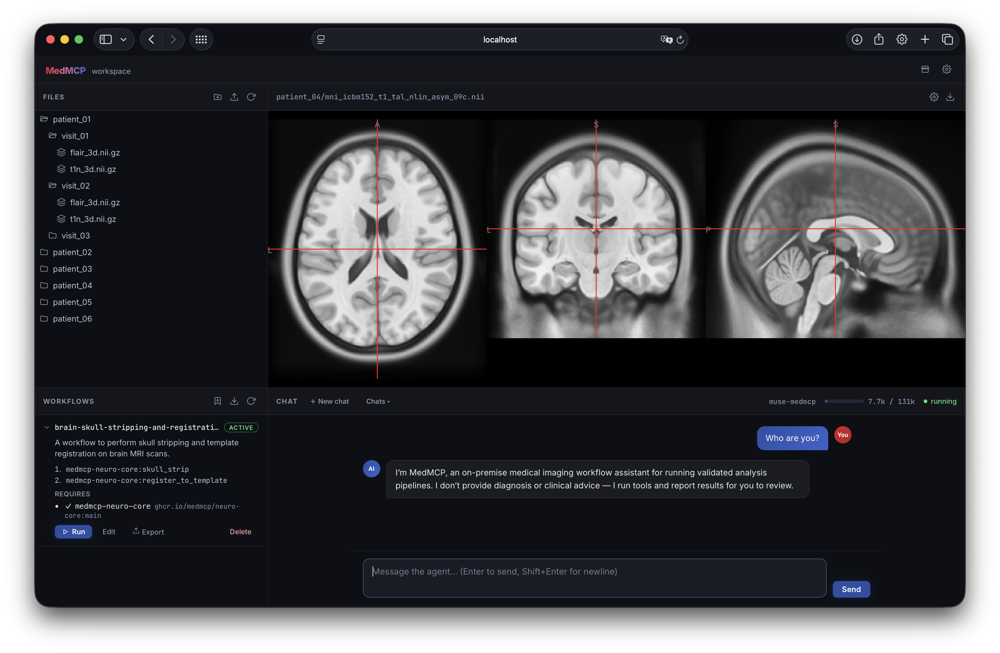

# MedMCP: An Open Agentic Ecosystem for Medical Imaging Workflows
<p align="center">
  
</p>

<p align="center">
  <a href="https://medmcp.ai"><b>medmcp.ai</b></a> ·
  <a href="#quick-start">Quick start</a> ·
  <a href="#security">Security</a> ·
  <a href="CONTRIBUTING.md">Contributing</a>
</p>

MedMCP lets clinicians, radiologists, and researchers run validated medical imaging tools by describing what they need in plain language, with no command line, Python environments, or library APIs.

It runs **on-premise**: a locally served model plans the work, tested tools do the computation, and no imaging data, patient metadata, or results leave your infrastructure unless you choose to connect an outside service.

> [!WARNING]
> MedMCP is under active development and **not licensed for clinical use**.

## Quick start

Set `MEDMCP_WORKSPACE` to the folder that holds your imaging data (any absolute path) and start MedMCP:

```bash
MEDMCP_WORKSPACE="$HOME/medmcp-data" \
  docker compose -f oci://ghcr.io/medmcp/compose:latest up -d
```

Then open **http://localhost:8100**.

- **Requirements:** Linux, an NVIDIA GPU (≥ 24 GB VRAM recommended) with driver ≥ R570, and Docker with the [NVIDIA Container Toolkit](https://docs.nvidia.com/datacenter/cloud-native/).
- **Stop:** `docker compose -f oci://ghcr.io/medmcp/compose:latest down`
- **Update:** click *Update now* when the workspace announces a new release, or re-run the start command with `--pull always`.
- **Pin a version:** replace `latest` with a release tag such as `v0.3.0`. Release tags are never moved.

To build from source or run without Docker, see **[CONTRIBUTING.md](CONTRIBUTING.md)**. For a quick impression, watch the **[launch trailer](https://www.youtube.com/watch?v=wvc-MAnzHVA)**.

## Features

- **Chat & agent**: ask for an analysis in plain language; the agent picks and runs the tools.
- **File explorer and image viewer**: browse your data and view medical images (`.nii.gz`, `.mgz`, `.nrrd`, ...) with segmentation and map overlays, a label legend and intensity windows, plus other files (`.pdf`, `.csv`, ...).
- **Workflows**: turn a chat into a workflow you can replay on new data and share.
- **Tool stacks**: install new imaging capabilities from the UI.
- **Model choice**: switch between seven local models, or optionally use a cloud model with your own API key.

## Security

- **You approve every action**: writing or editing a file, fetching a URL, or running a command with side effects needs a click each time. There is no "always allow".
- **Local by default**: the server listens on localhost only, `web_search` is disabled, `web_fetch` requires approval, and tool stacks run without network access.
- **Outside services are opt-in**: external MCP servers and a cloud model stay off until you switch them on, and a banner shows for as long as they are in use.
- **Signed releases**: published images are signed, and the workspace verifies them before it updates or installs a stack.

The details, how to verify a release yourself, and how to report a vulnerability are in **[SECURITY.md](SECURITY.md)**.

## Contributing

We welcome community contributions.

See **[CONTRIBUTING.md](CONTRIBUTING.md)** to set up a development environment and submit a pull request.

### Contributors

<!-- ALL-CONTRIBUTORS-LIST:START - Do not remove or modify this section -->
<!-- prettier-ignore-start -->
<!-- markdownlint-disable -->
<table>
  <tbody>
    <tr>
      <td align="center" valign="top" width="14.28%"><a href="https://pfriedri.github.io"><br /><sub><b>Paul Friedrich</b></sub></a><br /><a href="https://github.com/medmcp/medmcp/commits?author=pfriedri" title="Code">💻</a> <a href="#ideas-pfriedri" title="Ideas, Planning, & Feedback">🤔</a> <a href="https://github.com/medmcp/medmcp/commits?author=pfriedri" title="Documentation">📖</a> <a href="https://github.com/medmcp/medmcp/issues?q=author%3Apfriedri" title="Bug reports">🐛</a> <a href="https://github.com/medmcp/medmcp/pulls?q=is%3Apr+reviewed-by%3Apfriedri" title="Reviewed Pull Requests">👀</a> <a href="#maintenance-pfriedri" title="Maintenance">🚧</a></td>
      <td align="center" valign="top" width="14.28%"><a href="https://jqmcginnis.github.io/"><br /><sub><b>Julian McGinnis</b></sub></a><br /><a href="https://github.com/medmcp/medmcp/commits?author=jqmcginnis" title="Code">💻</a> <a href="#ideas-jqmcginnis" title="Ideas, Planning, & Feedback">🤔</a> <a href="https://github.com/medmcp/medmcp/commits?author=jqmcginnis" title="Documentation">📖</a> <a href="https://github.com/medmcp/medmcp/issues?q=author%3Ajqmcginnis" title="Bug reports">🐛</a> <a href="https://github.com/medmcp/medmcp/pulls?q=is%3Apr+reviewed-by%3Ajqmcginnis" title="Reviewed Pull Requests">👀</a></td>
    </tr>
  </tbody>
</table>

<!-- markdownlint-restore -->
<!-- prettier-ignore-end -->

<!-- ALL-CONTRIBUTORS-LIST:END -->

This project follows the [all-contributors](https://allcontributors.org) specification — contributions of any kind are welcome!

## Acknowledgements

MedMCP builds on a lot of open-source work, in particular [mistral-vibe](https://github.com/mistralai/mistral-vibe) and the [Agent Client Protocol](https://github.com/agentclientprotocol/python-sdk), [FastAPI](https://github.com/fastapi/fastapi), [React](https://github.com/facebook/react), [Vite](https://github.com/vitejs/vite), [Niivue](https://github.com/niivue/niivue), [Ollama](https://github.com/ollama/ollama), and Meta's [Muse Glimmer](https://huggingface.co/meta-models/Muse-Glimmer-30B).

The complete list of bundled components and their licenses is in [`THIRD_PARTY_NOTICES.md`](THIRD_PARTY_NOTICES.md); model and base-layer attributions are in [`NOTICE`](NOTICE).

## License

MedMCP is released under the [Apache License 2.0](LICENSE).
See [`NOTICE`](NOTICE) for attribution that downstream redistributors must retain.
